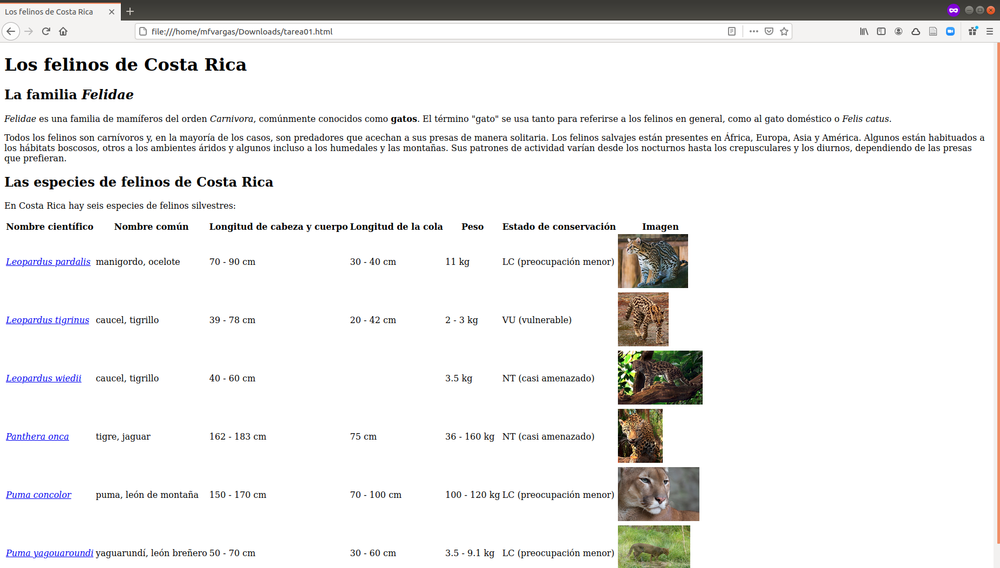

# TPB729 Desarrollo de sistemas de información geográfica en la Web
## Tarea 01 - HTML

### Fecha de entrega y entregables
La fecha y hora límites para la entrega es **miércoles 7 de abril de 2021 a las 5:00 p.m.**

Debe enviarle al profesor por correo electrónico la dirección para visualizar en GitHub Pages la página web resultante.

### Desarrollo
Desarrolle en GitHub Pages un documento HTML que luzca como el de la siguiente imagen:



Aspectos a calificar:

- Título y encabezados (10%)
- Uso de itálicas y negritas (10%) (puede usar los elementos ```strong``` y ```em```)
- Enlaces en los nombres científicos (30%)
- Estructura de la tabla (20%) (ubicación y cantidad de filas, columnas y encabezados)
- Imágenes (30%) (nótese el tamaño reducido y uniforme de todas las imágenes)

Publique la página resultante en GitHub Pages y envíele al profesor la dirección.

Se recomienda utiizar [Wikipedia](https://es.wikipedia.org/) para encontrar páginas e imágenes sobre las especies.
